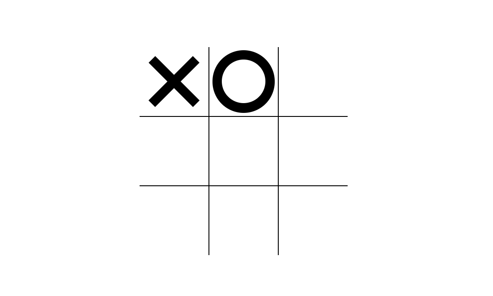

# Tic-Tac-Toe Game 🎮

Простая браузерная реализация классической игры "Крестики-нолики".

 

## 🔍 Описание

Игра рассчитана на двух игроков. Очерёдно ставьте крестики и нолики на игровом поле 3×3. Побеждает тот, кто первым выстроит линию из трёх своих символов по горизонтали, вертикали или диагонали.

 

## 🖼 Скриншот

 

## 🌐 Демо (GitHub Pages)

▶️ [Открыть игру в браузере](https://arturyeszhanov.github.io/tic-tac-toe-game/)

 
## 📁 Структура проекта
<pre lang="markdown">
tic-tac-toe-game/
├── index.html                 # Главная HTML-страница
├── style.css                  # Стили оформления игры
├── script.js                  # Логика игры на JavaScript
├── screenshot-placeholder.png # Скриншот игры
└── README.md                  # Описание проекта
</pre>